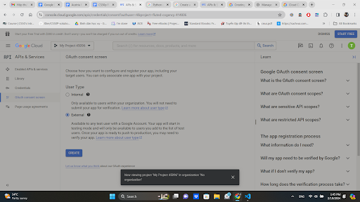
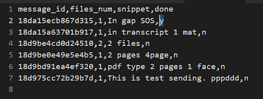

# Organizing email attachments with Gmail API.
#### Video Demo:  <URL HERE>
#### Description: My house has a photocopy shop and custumers will send files (attachments) via gmail. In order to save time opening mails and dowloading files manually, this program helps to keep track of custumers' order, files, and message. The program also help to organize files and remove completed orders, files.

### Setting up Gmail API:

Go to Google Cloud Project Quick Start for Python
https://developers.google.com/gmail/api/quickstart/python

Click [A Google Cloud Project](https://developers.google.com/workspace/guides/create-project) and create a Project

After create a project, go to API & Services > Enabled APIS & services.

Search for Gmail API and enable it.

Then go back to API & Services, chose OAuth consent screen and choose as image below.

Just save and contiue for scope.

At test users add users and enter your gmail account. Then at summary choose back to dash board.

Then, go to credentials > create credentials > OAuth client ID.

Choose Desktop App then create

Choose download json

Rename the downloaded file as credentials.json. Then, copy paste it into same folder as project.py. make sure your folder tree look like this, with order is an empty folder.

### My program's file:

- Orders.csv : Used to read custumers' order id, number of files, snippet(message), and completion status(done or not).

- Readed_id.csv: Used to log which id is readed. Each email has a unique id and this file record which email id is readed to avoid dowloading that email twice.

- test_project: pytest for this program.

- order folder: this folder will save all the attachments of emails. Each subfolder of this folder will be named as that email unique id.

### My program's function:
there are 3 args in my program:

- -u : used for login into your gmail account and download all new emails (whose id are not in readed_id.csv) that have attachment and then keep track of which files will need to print.

- -s or --show: used to show orders' detail in orders.csv

- -rm: remove completed order's file and order's detail in orders.csv.

### Example:
In your terminal, type: python project.py -u

If you see this, choose open.

You will be asked to log in your gmail account. Choose the gmail account that we registered in Gmail API (for me its aadatoanthien@gmail.com).

Choose continue

Continue

After successfully log in. You will see all the mail that have attachments in your gmail will be saved in the order folder.

Open order folder, you will see all the attachments are saved in folder that have the same name with their email's id.

You will also see a token.json, this file will save your log in information for next time so you won’t need to log in again.

Go to orders.csv, you will see id of gmail, number of file, message(snippet) of the email and completion status(done).

To see orders of custumer. use second arg: -s or --show along with an integer number of orders you want to see. You can use 'a' to see all orders.

In your terminal, execute: python project.py -s a or --show a, you should see all orders’ detail in orders.csv file:

Execute: python project.py -s 3

Assume you've completed printing the first order, change the first row completion status to y(yes). Then try third arg: -rm. The completed order’s files and its detail in orders.csv will be remove.

In your terminal, execute: python project.py -u -s a. The deleted order (18da15ecb867d315) will not download again because it is already resolved(and its id is saved in readed_id.csv)

